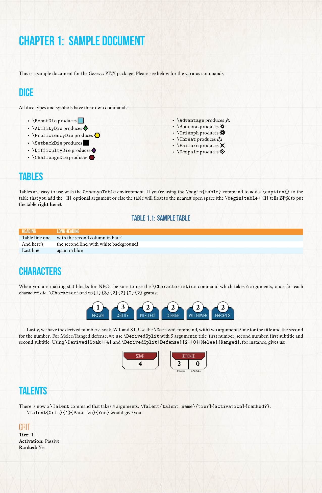

# Genesys RPG Package Documentation #

This is a LaTeX package to typeset documents in the format of the *Genesys* RPG published by Fantasy Flight Games.

## Installation ##

If you don't have `LaTeX` installed, [please do so first](https://www.tug.org/texlive/).

Then you need to clone the repo in your `\texmf` directory. If you haven't used a non-TeX Live package before, you'll have to [create the directory](https://tex.stackexchange.com/a/1167/62639).

If you don't know how to use LaTeX, I would suggest reading up on it on either [WikiBooks](https://en.wikibooks.org/wiki/LaTeX/) or [Share LaTeX](https://www.sharelatex.com/learn/).

## Fonts ##

There are two font families in the `/lib/fonts` directory that this package uses. Bebas is the title font, whereas Crimson is the closest free font to Minion Pro. If you have Minion Pro, just add `\setmainfont{Minion Pro}` in the preamble of your document.

## Using the Package & Options ##

In order to make use of this package you need to add `\usepackage{Genesys}` in your preamble.

Right now there is only one option, `[background]`, that adds the background image. By default it's hidden.

## Package Commands ##

The `Genesys.sty` package provides the following commands to make typesetting *Genesys* documents easier. Note that each of the *Genesys* commands are CamelCase starting with a capital letter.

### Dice & Symbols ###

Each die has its own command:

- `\BoostDie`
- `\AbilityDie`
- `\ProficienyDie`
- `\SetbackDie`
- `\DifficultyDie`
- `\ChallengeDie`

In addition, each symbol has its own command:

- `\Advantage`
- `\Success`
- `\Triumph`
- `\Threat`
- `\Failure`
- `\Despair`

### Stat Blocks ###

The following commands have been included to make NPC stat blocks easier. Note that they are not designed for character sheets, as they are sized for one column on a letter size piece of paper.

- `\Characteristics` requires 6 arguments, one for each characteristic
- `\Derived` creates the single-item derived boxes (wounds, soak, etc) and has two arguments; the first is the text while the second is the number
- `\DerivedSplit` is similar, but calls for 5 arguments:
	1. The box title
	2. Left box content
	3. Right box content
	4. Left box subtitle
	5. Right box subtitle

### Genesys Tables ###

The `\begin{GenesysTable}`  requires one argument: the table setup, using the `tabu` package. It sets the fonts and the header row background color. After the first row be sure to use the `\RowColors` command to get the alternating white/blue colors for the table rows.

## Example ##

